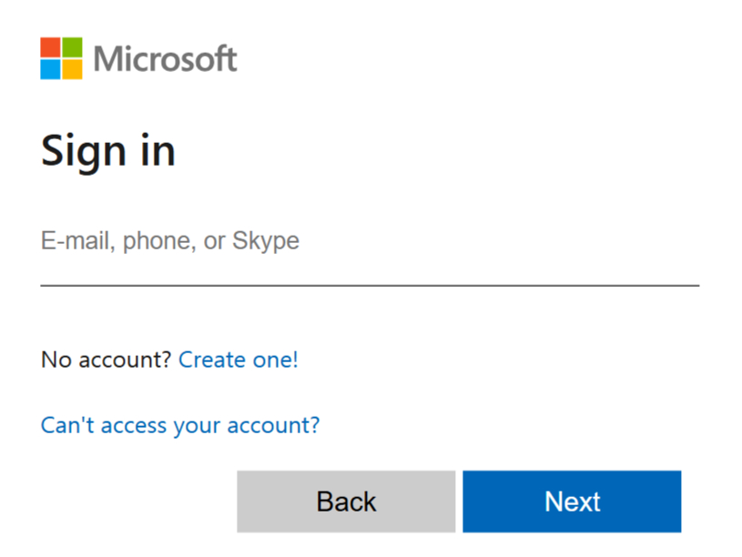

# 💻 **Microsoft Login Page UI**

This repository contains a clone of the Microsoft Login Page using **HTML** and **CSS**.

---

## 🌐 **Overview**

This project replicates the design of Microsoft's login page using only HTML and CSS. It demonstrates responsive design techniques and CSS grid usage for creating the logo.

🔗 [View Code on GitHub](https://github.com/Developer-Parth/Microsoft-Login-Page-UI)

---

## 🟨🟩🟥🟦 **Microsoft Logo**

The Microsoft logo is created using **HTML RECT FILL**:

| Color     | Hex Code  |
| --------- | --------- |
| 🟨 Yellow | `#fbbc05` |
| 🟩 Green  | `#34a853` |
| 🟥 Red    | `#ea4335` |
| 🟦 Blue   | `#4285f4` |

---

## 📋 **Project Features**

- ✅ Responsive design
- ✅ Username and password input fields
- ✅ "Forgot password?" and "Create account" links
- ✅ Pixel-perfect UI design

---

## 🛠️ **Tech Stack**

| Technology | Description               |
| ---------- | ------------------------- |
| 💻 HTML5   | Structure of the page     |
| 🎨 CSS3    | Styling and layout design |

---

## 🗂️ **Project Structure**

```plaintext
📁 microsoft-login-clone
├── 📄 index.html
├── 💅 styles.css
└── 🖼️ preview.png
```

---

## 📊 **Responsive Design Chart**

| Screen Size              | Layout Adjustment                     |
| ------------------------ | ------------------------------------- |
| 🖥️ Desktop (≥1024px)    | Full-width form with center alignment |
| 💻 Laptop (768px-1023px) | Reduced padding and optimized spacing |
| 📱 Mobile (≤767px)       | Stacked layout with fluid width       |

---

## 🚀 **Getting Started**

💡 Ensure that you use a modern browser for optimal performance and compatibility.

1. Clone the repository:
   ```bash
   git clone https://github.com/Developer-Parth/Microsoft-Login-Page-UI.git
   ```
2. Open  HTML FILE in your browser.

---

## 💡 **Learning Outcomes**

- ♿ Emphasis on accessibility best practices
- 📚 Improved HTML and CSS skills
- 🧩 Understanding of CSS Grid and Flexbox
- 📱 Responsive web design techniques

---

## ❤️ **Contributing**

Feel free to contribute to this project by submitting pull requests. Suggestions for enhancements are welcome!

---

## 📞 **Contact**

📧 Email: parththukral876@gmail.com

---

## 🏁 **Conclusion**

This project is a great way to practice front-end development skills using HTML and CSS. Happy coding! 😊

